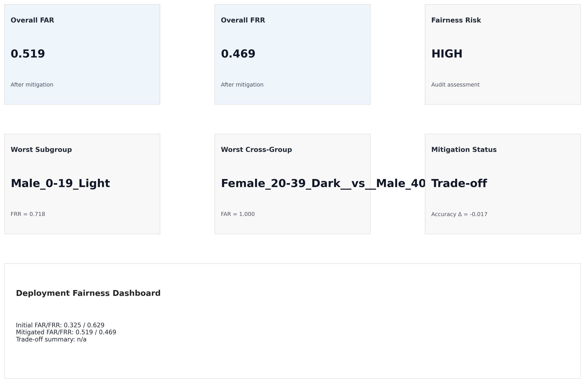
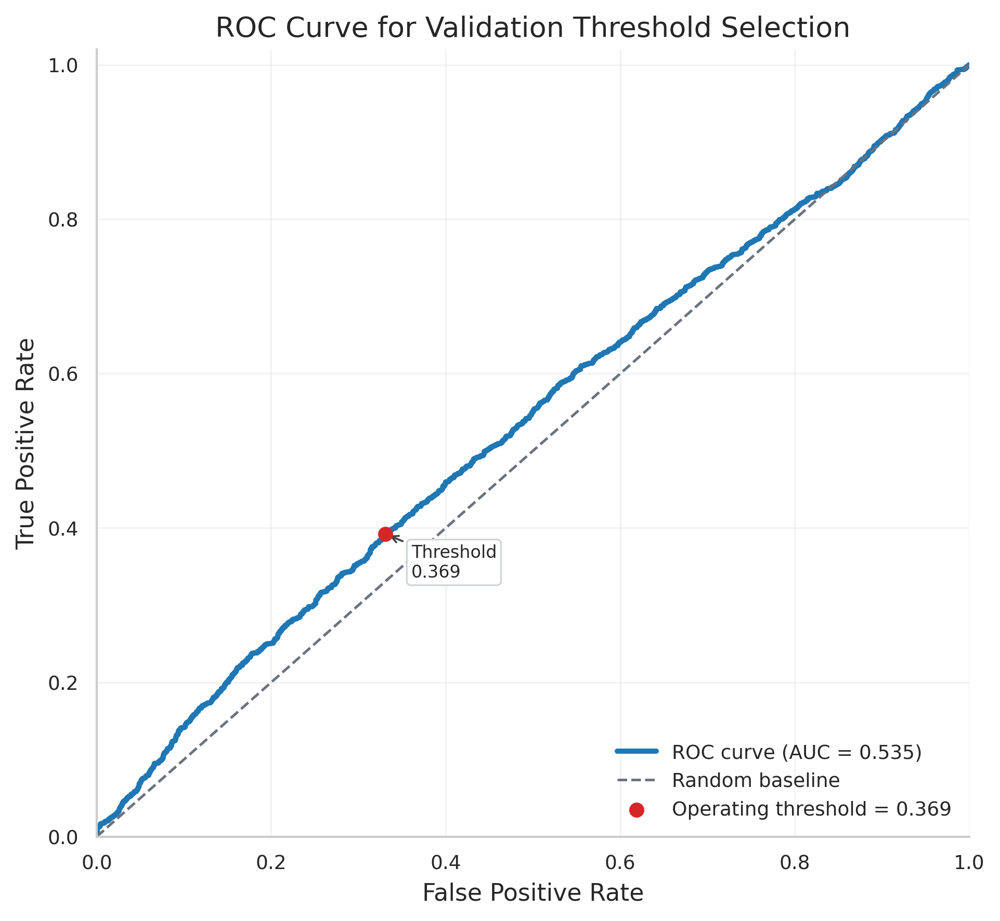
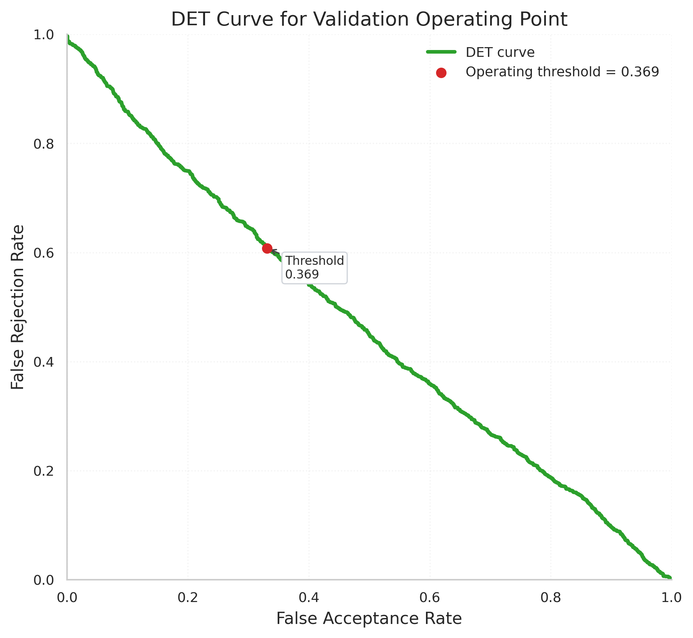
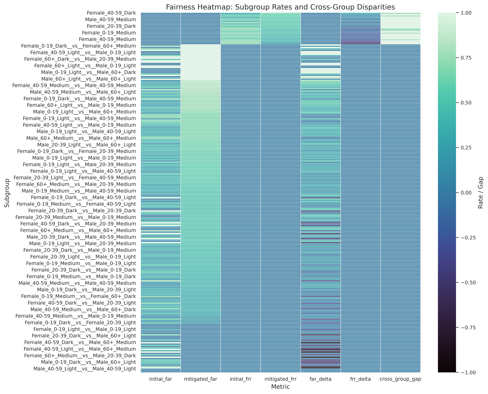
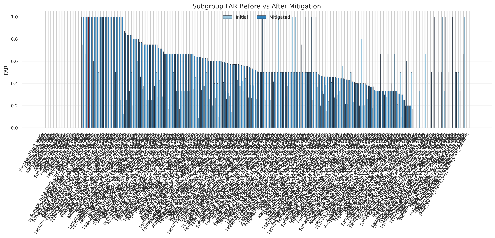
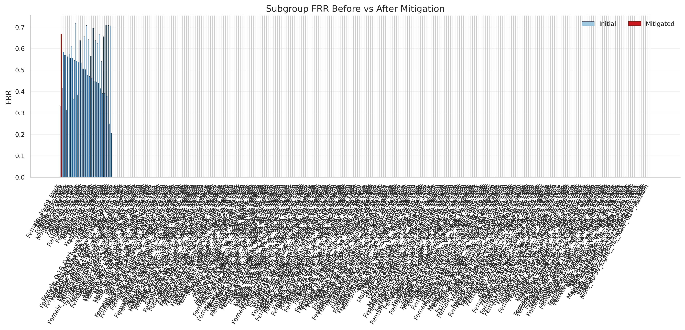
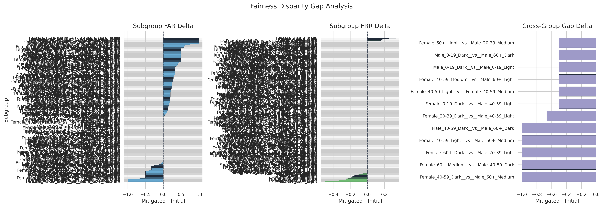
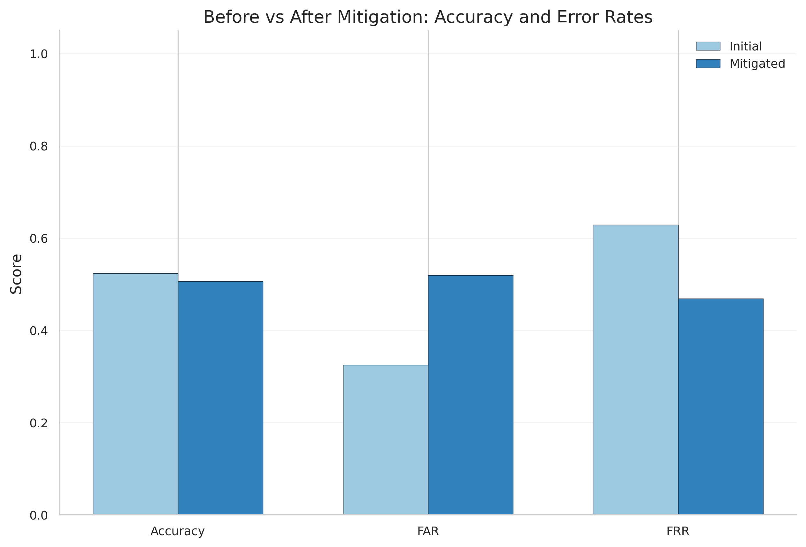

# Facial Fairness Audit System

    

Responsible AI • Fairness Auditing • Face Verification • Bias Mitigation

This project implements a reproducible, end-to-end fairness audit for face verification systems. It includes dataset preparation, metric-learning training (ResNet18 + 128-D embeddings), operating-point selection, disaggregated audits across intersectional demographics, a simple mitigation stage, and re-evaluation with publication-quality visualizations.

Keywords: Responsible AI · Fairness Auditing · Face Verification · Bias Mitigation · Deep Learning

## Quick results

| Metric                 |           Value |
| ---------------------- | --------------: |
| ROC AUC                |         0.53499 |
| Threshold (validation) |    0.3687057197 |
| Fairness risk          |            HIGH |
| Worst subgroup         | Male_0-19_Light |
| Audit pairs            |            4486 |
| Tests passed           |         27 / 27 |

## Project highlights

- ✔ End-to-end fairness audit pipeline
- ✔ FairFace demographic analysis
- ✔ ResNet18 + Triplet Loss (128-D embeddings)
- ✔ Bias mitigation (balanced sampling + weighted triplet loss)
- ✔ Cross-group fairness evaluation (pairwise deltas)
- ✔ Dockerized execution (container + smoke test)
- ✔ Automated testing (27 pytest tests)
- ✔ Publication-quality visualizations (8 plots)

## Dashboard preview



This dashboard summarizes subgroup performance, disparity analysis, and mitigation outcomes.

## Technology stack

- Python
- PyTorch
- Torchvision
- Scikit-learn
- Pandas
- NumPy
- Docker / Docker Compose
- Matplotlib / Seaborn
- FairFace dataset

---

## Table of contents

- [Project overview](#project-overview)
- [Problem statement](#problem-statement)
- [Project objectives](#project-objectives)
- [Dataset](#dataset)
- [System architecture](#system-architecture)
- [Fairness methodology](#fairness-methodology)
- [Model architecture](#model-architecture)
- [Bias mitigation strategy](#bias-mitigation-strategy)
- [Results](#results)
- [Visualizations](#visualizations)
- [Key findings](#key-findings)
- [Ethical considerations](#ethical-considerations)
- [Deployment recommendation](#deployment-recommendation)
- [Repository structure](#repository-structure)
- [Docker setup](#docker-setup)
- [Testing](#testing)
- [Project outputs](#project-outputs)
- [Future work](#future-work)
- [Author](#author)

---

## Project overview

Facial recognition and verification systems can exhibit demographic disparities that produce unequal false acceptance or false rejection rates across gender, age and skin-tone groups. This project builds an end-to-end audit pipeline to quantify these disparities, apply a targeted mitigation strategy, and re-evaluate fairness and utility using real artifacts produced by the pipeline.

Scope: per-demographic and intersectional audits across Gender, Age, and Skin Tone.

## Problem statement

Biometric systems impact access and security. When error rates vary across demographics, harms include:

- Unequal rejection rates (legitimate users denied access)
- Unequal acceptance rates (higher false acceptance for some groups)
- Systemic demographic bias that compounds downstream decisions

The project quantifies these harms and produces actionable mitigation recommendations.

## Project objectives

- Train a face verification model
- Measure demographic performance
- Identify disparities
- Mitigate unfairness
- Produce deployment recommendations

## Dataset

Dataset: FairFace (face images labeled with age, gender, race/skin tone). The pipeline uses demographic metadata (age, gender, race) to build subgroup labels and intersectional slices (e.g., `Female_20-39_Dark`). Subgroups are used for both within-group and cross-group pairwise evaluation.

Metadata used: `age`, `gender`, `race`.

## System architecture

Dataset → Preprocessing → Pair/Triplet Generation → ResNet18 → 128-D Embeddings → Triplet Loss → Threshold Selection → Fairness Audit → Mitigation → Re-Audit

```mermaid
flowchart LR

	A[Dataset] --> B[Preprocessing]
	B --> C[Pair and Triplet Generation]
	C --> D[ResNet18 Backbone]
	D --> E[128D Embeddings]
	E --> F[Triplet Loss Training]
	F --> G[Threshold Selection]
	G --> H[Fairness Audit]
	H --> I[Bias Mitigation]
	I --> J[Mitigated Re Audit]
	J --> K[Visualization and Reporting]
```



## ⚖️ Fairness methodology

Demographic groups audited:

- Gender: Male, Female
- Age: 0-19, 20-39, 40-59, 60+
- Skin Tone (proxy): Light, Medium, Dark

Metrics:

- FAR (False Acceptance Rate)
- FRR (False Rejection Rate)
- ROC AUC
- Threshold analysis
- Cross-group evaluation (pairwise deltas)

## Model architecture

- ResNet18 backbone (torchvision)
- Embedding layer: 128-D, L2-normalized
- Training objective: Triplet-loss (mitigation uses a weighted variant)

## 🛡️ Bias mitigation strategy

Approach used in this study:

- Balanced sampling: oversample underrepresented slices during mitigation training.
- Weighted triplet loss: give higher training weight to triplets containing under-served subgroups.

Rationale: simple, interpretable interventions that focus optimization on under-served slices while maintaining reproducibility.

## 📊 Results

All numeric values below are read directly from the pipeline artifacts under `results/` (see: [results/threshold_analysis.json](results/threshold_analysis.json), [results/fairness_summary.json](results/fairness_summary.json), [results/fairness_comparison.json](results/fairness_comparison.json), [results/overall_metrics.json](results/overall_metrics.json), [results/analysis.json](results/analysis.json)).

### Performance

| Metric                 |      Initial |    Mitigated |
| ---------------------- | -----------: | -----------: |
| Accuracy               |      0.52341 |      0.50602 |
| FAR                    |     0.324565 |      0.51939 |
| FRR                    |     0.628622 |      0.46857 |
| Threshold (validation) | 0.3687057197 | 0.3687057197 |
| ROC AUC (validation)   |      0.53499 |      0.53499 |
| Validation pairs       |         4476 |         4476 |

### Fairness summary

| Metric                                   | Value                                                        |
| ---------------------------------------- | ------------------------------------------------------------ |
| Fairness risk level                      | HIGH                                                         |
| Average disparity reduction (mitigation) | 0.10475                                                      |
| Best improved subgroup                   | Female_40-59_Light                                           |
| Worst subgroup (FRR)                     | Male_0-19_Light — FRR 0.717647 (support 85)                  |
| Worst cross-group pairing                | Female_20-39_Dark**vs**Male_40-59_Dark — FAR 1.0 (support 1) |
| Accuracy change (mitigated - initial)    | -0.01739                                                     |
| FAR change                               | +0.19483                                                     |
| FRR change                               | -0.16005                                                     |

Notes: The ROC AUC near 0.535 and the high FRR indicate weak match/non-match separation at the chosen operating point. Several extreme cross-group values are associated with very low support and should be interpreted cautiously.

Interpretation: The mitigation strategy produced a measurable reduction in FRR while increasing FAR, demonstrating an explicit fairness–performance trade-off: mitigation improved accessibility (fewer false rejections) for under-served subgroups but raised the system's false acceptance rate. This outcome suggests further work is needed on calibration, per-group score adjustment, or alternative mitigation methods to recover security without re-introducing subgroup disparities.

## 📈 Visualizations

Publication-ready figures (generated by the pipeline) are available under `artifacts/plots/`. Click each thumbnail to open the full-resolution file in the repository.

Short descriptions:

- **ROC Curve:** Shows verification trade-offs across thresholds.
- **DET Curve:** Visualizes FAR–FRR operating behavior.
- **Fairness Heatmap:** Highlights subgroup disparities at a glance.
- **Dashboard:** Executive summary of subgroup performance, disparity analysis, and mitigation outcomes.

<details>
<summary>ROC & DET</summary>

[ROC Curve](artifacts/plots/roc_curve_publication.png)



[DET Curve](artifacts/plots/det_curve_publication.png)



</details>

<details>
<summary>Fairness charts & dashboard</summary>

[Fairness heatmap](artifacts/plots/fairness_heatmap.png)



[Subgroup FAR chart](artifacts/plots/subgroup_far_chart.png)



[Subgroup FRR chart](artifacts/plots/subgroup_frr_chart.png)



[Disparity plot](artifacts/plots/disparity_gap_plot.png)



[Mitigation comparison](artifacts/plots/mitigation_comparison.png)



[Dashboard](artifacts/plots/fairness_dashboard.png)


</details>

## Key findings

- The mitigation reduced FRR (improving acceptance for some groups) but increased FAR, producing a clear security vs accessibility trade-off.
- The worst subgroup FRR (Male_0-19_Light = 0.71765) requires focused remediation.
- Cross-group instability and low-support pairings inflate some disparity estimates; additional data collection is needed for robust conclusions.

## Ethical considerations

- This repository is intended for research and audit. The pipeline reports a **HIGH** fairness risk and explicitly recommends against high-stakes deployment without further work.
- Suggested safeguards: human-in-the-loop decisions for critical flows, strict monitoring, transparent reporting, and public accountability for model updates.

## Deployment recommendation

The audit demonstrates concrete fairness and utility limitations that must be addressed before any high-stakes deployment. In particular, elevated FRR and large FRR gaps across subgroups indicate the system would likely deny legitimate access to certain demographic groups at disproportionate rates. Additionally, several cross-group pairings show unstable behavior driven by very low support counts, which undermines the reliability of pairwise fairness estimates.

Before production use, the system requires: targeted data collection for low-support slices, stronger calibration or per-group score adjustment, and a clear human-in-the-loop policy for edge cases. Monitoring and periodic re-audits should be integrated into any deployment pipeline to detect regressions and distributional shifts.

Not recommended for high-stakes deployment without additional fairness validation.

## Repository structure

```
facial-fairness-audit/
│
├── src/
│   ├── api/
│   ├── audit/
│   ├── data/
│   ├── evaluation/
│   ├── mitigation/
│   ├── models/
│   ├── training/
│   └── utils/
│
├── tests/
│
├── artifacts/
│   ├── checkpoints/
│   ├── embeddings/
	├── plots/
	├── model.pth
	├── best_model.pth
	├── mitigated_model.pth
	└── best_mitigated_model.pth
│
├── results/
│   ├── threshold_analysis.json
	├── initial_audit.json
	├── mitigated_audit.json
	├── fairness_summary.json
	├── fairness_comparison.json
	├── overall_metrics.json
	└── analysis.json
│
├── submission/
│   ├── deployment_memo.pdf
	└── executive_summary.md
│
├── notebooks/
├── scripts/
├── docker-compose.yml
├── Dockerfile
├── requirements.txt
└── README.md
```

### Directory purposes

| Directory     | Purpose                                                          |
| ------------- | ---------------------------------------------------------------- |
| `src/`        | Core project implementation and pipeline code                    |
| `audit/`      | Fairness auditing and subgroup analysis (under `src/`)           |
| `mitigation/` | Bias mitigation techniques and training utilities (under `src/`) |
| `evaluation/` | Metrics, visualizations, and threshold analysis (under `src/`)   |
| `artifacts/`  | Saved models, checkpoints, embeddings, and generated plots       |
| `results/`    | JSON outputs and audit reports produced by the pipeline          |
| `submission/` | Final deliverables (memo, executive summary, PDFs)               |
| `tests/`      | Automated validation suite (pytest)                              |

This structure keeps implementation, evaluation, and deliverables clearly separated for reproducibility and easy review by researchers and engineers.

## Docker setup

Build and run with Docker Compose (requires Docker on host):

```bash
docker-compose up -d --build
docker ps
docker-compose down
```

The repository includes `scripts/docker_smoke_test.py` and a record of the verification outcome at `results/docker_verification.json` which documents host-side smoke checks and notes about Docker availability during authoring.

## Testing

- There are **27** automated tests under `tests/`. Run them with:

```bash
pytest -v
```

The suite covers pipeline components, evaluation and visualization sanity checks, and end-to-end smoke behaviors.

## Project outputs

- `results/` — JSON summaries (thresholds, audits, comparisons, analysis)
- `artifacts/` — checkpoints and publication plots
- `submission/` — deployment memo and executive summary (PDF)

## Future work

- Collect targeted data for under-supported intersectional slices
- Calibrate scores (per-group and post-hoc) and explore alternative fairness-aware objectives
- Stronger cross-validation and larger held-out demographic sets for robust claims

## Author

Rakesh Chinni — B.Tech CSE-AIML

Responsible AI / ML Engineering Project

---

If you want, I can commit this README and run a quick link-check to confirm file references render correctly on GitHub.
